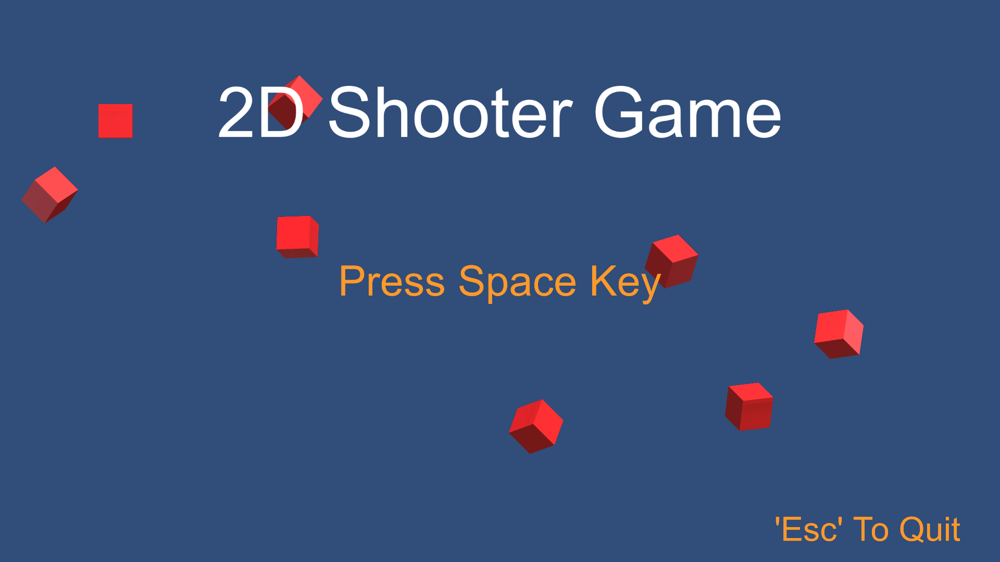

<p align="center">
  
</p>

<div align="center">

# BasicUnity2DShooter

**A wave-based 2D shoot-'em-up built in Unity.** Enemies sweep in along curved paths, and each
wave sets a kill count you have to reach before it advances.


[![Play in browser][badge-play]][play] &nbsp; [![Download build][badge-download]][releases]

</div>

---

## Gameplay

You pilot a ship across the lower half of the screen. Enemies fly in on curved paths and you shoot
them out of the air. Every wave has a required number of kills: reach it and the next wave starts;
miss it, or take a hit, and the run ends. Clearing the final wave wins.

## Controls

| Action | Keys |
| --- | --- |
| Move | Arrow keys or WASD |
| Sprint | Left Shift or Right Shift |
| Shoot | Z or Space |
| Start (title screen) | Space |
| Back to title / quit | Esc |

## Features

- Curved enemy attack paths built from a few waypoints, drawn on screen as a preview before the enemies fly them.
- Waves authored in the inspector: a kill quota plus timed sets of enemies, each with its own spawner, count, and path duration.
- Object pooling for bullets and enemies, preallocated so firing does not allocate mid-fight.
- A shader-cutoff screen wipe between the title and the game.
- Particle effects on player and enemy death, and one-shot sound for shooting, new waves, wins, and losses.

## Project structure

```
Assets/Scripts/
├─ StageLoop.cs        gameplay and wave state machine
├─ TitleLoop.cs        title screen and background spawns
├─ Player.cs           movement, shooting, death
├─ Enemy.cs            path-following enemy
├─ PlayerBullet.cs     player projectile
├─ EnemySpawner.cs     spawns enemies along a bezier path
├─ AudioHandler.cs     one-shot sound effects
├─ PFXHandler.cs       player and enemy death particles
├─ Pools/              generic object pool, plus bullet and enemy pools
├─ UI/                 shader screen-wipe transition
└─ Utilities/          state machine and cubic-bezier spline
```

## For developers

Three pieces worth a look if you open the code:

- **Shared state machine** (`Utilities/SimpleStateMachine.cs`, `Utilities/EnumDirectedStateMachine.cs`). A state is three optional delegates (enter, update, exit), addressed by an enum. That one utility runs the menu, the wave loop, the spawner, and the screen wipe.
- **Bezier path math** (`Utilities/BezierSpline.cs`). Chains cubic segments through any number of points using neighbor-based tangents, returning a position for a time value from 0 to 1.
- **Object pool** (`Pools/ObjectPool.cs`). Preallocated reuse: a free list drawn from the back and a linked list of active objects for constant-time removal.

## Play

- **In your browser:** [play the WebGL build][play].
- **Download:** grab the latest build from the [Releases page][releases]. A copy of the packaged build also lives in `Release/BasicUnity2DShooter.7z`.

## Build from source

1. Open the folder in Unity 2022.3.9f1 (Unity Hub, Add, then select this project).
2. Open `Assets/Scenes/SampleScene.unity`.
3. Press Play.

## Credits

- Code: Christopher A. All 15 gameplay scripts carry the author header.
- Hit and impact particle effects: the imported `FX_Hit_Collection` asset pack, under `Assets/FX_Hit_Collection/`.

## License

No license file is included, so default copyright applies: the author reserves all rights unless stated otherwise.

<!-- Links -->
[badge-play]: https://img.shields.io/badge/Play-in%20browser-2ea44f?logo=webgl&logoColor=white
[badge-download]: https://img.shields.io/badge/Download-latest%20build-e67e22?logo=github&logoColor=white
[play]: https://cdiamond0231.github.io/basic-unity-2d-shooter-webgl/
[releases]: https://github.com/CDiamond0231/unity-basic-2d-shooter-game/releases/latest
